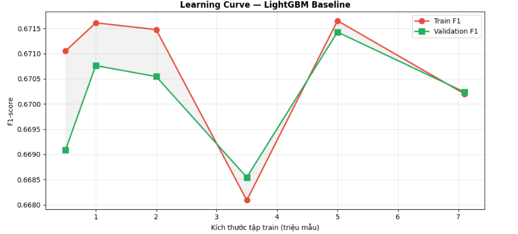
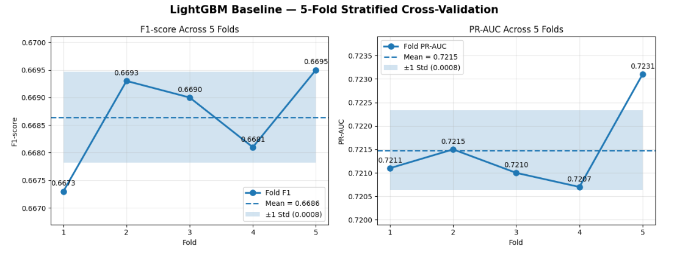
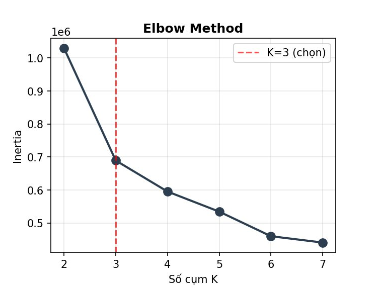
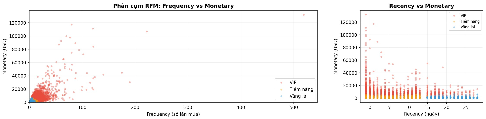

# Dự đoán Khả năng Mua hàng của Khách hàng Thương mại Điện tử bằng Machine Learning

## Giới thiệu

Đây là repository mã nguồn và kết quả thực nghiệm phục vụ khóa luận tốt nghiệp với đề tài:

**"Dự đoán khả năng mua hàng của khách hàng thương mại điện tử bằng các phương pháp học máy"**

Nghiên cứu tập trung xây dựng mô hình dự đoán khả năng phát sinh giao dịch mua hàng của khách hàng dựa trên dữ liệu hành vi truy cập website thương mại điện tử.

Các thuật toán được đánh giá bao gồm:

- Logistic Regression
- Random Forest
- XGBoost
- LightGBM

Ngoài ra, nghiên cứu còn thực hiện:

- Phân tích RFM (Recency – Frequency – Monetary)
- Phân cụm khách hàng bằng MiniBatch K-Means
- Đánh giá Cross-Validation
- Phân tích Learning Curve
- Tối ưu hóa ngưỡng phân loại (Threshold Optimization)

---

## Bộ dữ liệu

Nguồn dữ liệu:

**eCommerce Behavior Data from Multi Category Store (Kaggle)**

Đặc điểm dữ liệu sau khi tổng hợp:

- Khoảng 67 triệu bản ghi sự kiện gốc
- Hơn 7 triệu phiên truy cập
- Hàng triệu khách hàng và sản phẩm

Do kích thước dữ liệu rất lớn nên bộ dữ liệu gốc không được đưa vào repository này.

---

## Quy trình nghiên cứu

### 1. Tiền xử lý dữ liệu

- Làm sạch dữ liệu
- Tổng hợp dữ liệu theo phiên truy cập
- Xử lý giá trị thiếu
- Sinh biến đặc trưng hành vi

### 2. Xây dựng đặc trưng

Các nhóm đặc trưng chính:

- Session Features
- Behavioral Features
- Product Interaction Features
- Temporal Features
- RFM Features

### 3. Huấn luyện mô hình

Các cấu hình được đánh giá:

- Baseline
- Class Weight
- SMOTE Oversampling
- Random Undersampling

### 4. Đánh giá mô hình

Các thước đo:

- Precision
- Recall
- F1-score
- PR-AUC

Phương pháp đánh giá:

- Hold-out Validation
- Stratified 5-Fold Cross Validation

---

# Kết quả tiêu biểu

## Learning Curve của LightGBM



Biểu đồ cho thấy hiệu năng huấn luyện và kiểm định duy trì ổn định khi tăng kích thước tập dữ liệu, đồng thời không xuất hiện dấu hiệu overfitting nghiêm trọng.

---

## Cross-Validation của LightGBM



Kết quả 5-Fold Cross Validation cho thấy mô hình duy trì hiệu năng ổn định giữa các fold với độ lệch chuẩn thấp.

---

## Feature Importance


Biểu đồ thể hiện mức độ đóng góp của các đặc trưng đối với quyết định dự đoán của mô hình LightGBM.

---

## Phân cụm khách hàng bằng RFM

### Elbow Method



### Trực quan hóa các phân khúc khách hàng



Kết quả phân cụm cho thấy khách hàng có thể được chia thành các nhóm:

- VIP
- Tiềm năng
- Vãng lai

---

# Cấu trúc thư mục
```text
customer-purchase-prediction-thesis/
│
├── readme.md
├── requirements.txt
├── customer_purchase_prediction.ipynb
│
├── outputs/
│   ├── results_v3.csv
│   └── rfm_clusters.csv
│
├── comparison_f1_prauc.png
├── feature_importance.png
├── feature_set_comparison.png
├── lgb_confusion_matrix.png
├── lgb_cv.png
├── lgb_learning_curve.png
├── lgb_sweep_spw.png
├── lgb_threshold_curve.png
├── rfm_boxplot.png
├── rfm_elbow.png
├── rfm_pie_bar.png
└── rfm_scatter.png
```
---

# Hướng dẫn cài đặt

Tạo môi trường Python:

```bash
python -m venv venv
```

Kích hoạt môi trường:

```bash
source venv/bin/activate
```

hoặc trên Windows:

```bash
venv\Scripts\activate
```

Cài đặt thư viện:

```bash
pip install -r requirements.txt
```

---

# Tái lập kết quả

Toàn bộ mã nguồn sử dụng trong khóa luận được cung cấp trong file:

```text
customer_purchase_prediction.ipynb
```

Do kích thước dữ liệu lớn (hàng chục triệu bản ghi), việc chạy lại toàn bộ pipeline có thể mất nhiều giờ tùy thuộc vào cấu hình phần cứng.

Các kết quả trung gian, bảng số liệu và hình ảnh đã được lưu trong thư mục:

```text
outputs/
figures/
```

để hỗ trợ việc kiểm tra và đối chiếu kết quả.

---

# Tác giả


**Dự đoán khả năng mua hàng của khách hàng thương mại điện tử bằng Machine Learning**